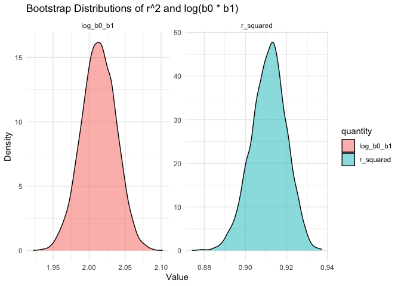
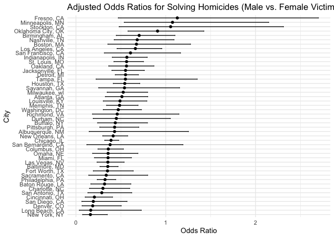
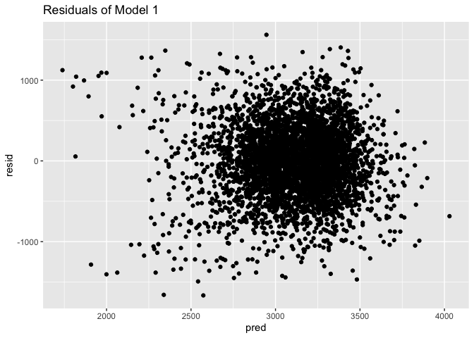
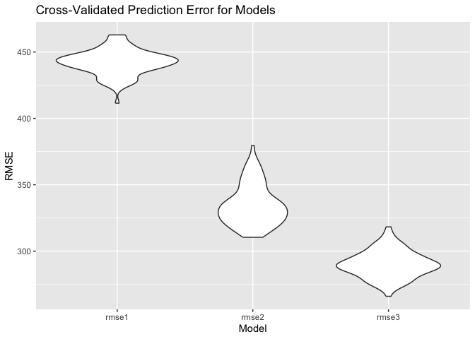

p8105_hw6_sz3214
================
2024-12-01

# Problem 1

``` r
weather_df = 
  rnoaa::meteo_pull_monitors(
    c("USW00094728"),
    var = c("PRCP", "TMIN", "TMAX"), 
    date_min = "2017-01-01",
    date_max = "2017-12-31") |>
  mutate(
    name = recode(id, USW00094728 = "CentralPark_NY"),
    tmin = tmin / 10,
    tmax = tmax / 10) |>
  select(name, id, everything())
```

    ## using cached file: /Users/sherryzhang/Library/Caches/org.R-project.R/R/rnoaa/noaa_ghcnd/USW00094728.dly

    ## date created (size, mb): 2024-12-01 19:16:57.615336 (8.667)

    ## file min/max dates: 1869-01-01 / 2024-11-30

``` r
set.seed(1)
```

**bootstrapping**

``` r
boot_sample = function(df) {
  sample_frac(df, replace = TRUE)
}

boot_straps = tibble(bootstrap_id = 1:5000) |>
  mutate(
    strap_sample = map(bootstrap_id, ~ boot_sample(weather_df))
  ) |>
  mutate(
    models = map(strap_sample, ~ lm(tmax ~ tmin, data = .x)),
    glance_results = map(models, broom::glance),
    tidy_results = map(models, broom::tidy)
  )

bootstrap_results = boot_straps |>
  mutate(
    r_squared = map_dbl(glance_results, ~ .x$r.squared),
    log_b0_b1 = map_dbl(tidy_results, ~ {
      coefs = .x |> filter(term %in% c("(Intercept)", "tmin"))
      log(prod(coefs$estimate))
    })
  )
```

**Plot the distributions of r^2 and log(b0 \* b1)**

``` r
bootstrap_results |>
  pivot_longer(cols = c(r_squared, log_b0_b1), names_to = "quantity", values_to = "value") |>
  ggplot(aes(x = value, fill = quantity)) +
  geom_density(alpha = 0.5) +
  facet_wrap(~quantity, scales = "free") +
  theme_minimal() +
  labs(title = "Bootstrap Distributions of r^2 and log(b0 * b1)",
       x = "Value",
       y = "Density")
```

<!-- -->

**95% CI**

``` r
bootstrap_results |>
  summarize(
    r_squared_ci_lower = quantile(r_squared, 0.025),
    r_squared_ci_upper = quantile(r_squared, 0.975),
    log_b0_b1_ci_lower = quantile(log_b0_b1, 0.025),
    log_b0_b1_ci_upper = quantile(log_b0_b1, 0.975)
  )
```

    ## # A tibble: 1 × 4
    ##   r_squared_ci_lower r_squared_ci_upper log_b0_b1_ci_lower log_b0_b1_ci_upper
    ##                <dbl>              <dbl>              <dbl>              <dbl>
    ## 1              0.894              0.927               1.96               2.06

# Problem 2

**data import and cleaning**

``` r
homicide = read.csv("homicide-data.csv") |> 
  janitor::clean_names() |> 
  filter(
    !city %in% c("Dallas", "Phoenix", "Kansas City", "Tulsa"),
    victim_race %in% c("White", "Black")
  ) |>
  mutate(
    city_state = paste(city, state, sep = ", "),
    victim_age = as.numeric(victim_age),
    resolved = ifelse(disposition %in% c("Closed by arrest", "Closed without arrest"), 1, 0)
  )
```

    ## Warning: There was 1 warning in `mutate()`.
    ## ℹ In argument: `victim_age = as.numeric(victim_age)`.
    ## Caused by warning:
    ## ! NAs introduced by coercion

**Logistic regression for Baltimore**

``` r
baltimore = homicide |>
  filter(city_state == "Baltimore, MD")

baltimore_model = glm(
  resolved ~ victim_age + victim_sex + victim_race, 
  data = baltimore, 
  family = binomial()
)

baltimore_results = baltimore_model |> 
  broom::tidy() |>
  filter(term == "victim_sexMale") |>
  mutate(
    odds_ratio = exp(estimate), 
    conf.low = exp(estimate - 1.96 * std.error),  
    conf.high = exp(estimate + 1.96 * std.error) 
  )|>
    select(odds_ratio, conf.low, conf.high)

baltimore_results
```

    ## # A tibble: 1 × 3
    ##   odds_ratio conf.low conf.high
    ##        <dbl>    <dbl>     <dbl>
    ## 1      0.355    0.268     0.469

**Logistic regression for all cities**

``` r
citywise = homicide |>
  group_by(city_state) |>
  nest() |>
  mutate(
    glm_model = map(data, ~ glm(resolved ~ victim_age + victim_sex + victim_race, data = .x, family = binomial())),
    results = map(glm_model, ~ broom::tidy(.x))
  ) |>
  unnest(results) |>
  filter(term == "victim_sexMale") |>
  mutate(
    odds_ratio = exp(estimate),
    conf.low = exp(estimate - 1.96 * std.error),
    conf.high = exp(estimate + 1.96 * std.error)
  ) |> 
  select(city_state, odds_ratio, conf.low, conf.high)

citywise
```

    ## # A tibble: 46 × 4
    ## # Groups:   city_state [46]
    ##    city_state      odds_ratio conf.low conf.high
    ##    <chr>                <dbl>    <dbl>     <dbl>
    ##  1 Albuquerque, NM      0.430    0.148     1.25 
    ##  2 Atlanta, GA          0.512    0.328     0.799
    ##  3 Baltimore, MD        0.355    0.268     0.469
    ##  4 Baton Rouge, LA      0.319    0.166     0.612
    ##  5 Birmingham, AL       0.704    0.450     1.10 
    ##  6 Boston, MA           0.674    0.356     1.28 
    ##  7 Buffalo, NY          0.438    0.241     0.796
    ##  8 Charlotte, NC        0.301    0.151     0.598
    ##  9 Chicago, IL          0.391    0.321     0.476
    ## 10 Cincinnati, OH       0.206    0.104     0.408
    ## # ℹ 36 more rows

**plot**

``` r
citywise |>
  ggplot(aes(x = reorder(city_state, odds_ratio), y = odds_ratio)) +
  geom_point() +
  geom_errorbar(aes(ymin = conf.low, ymax = conf.high), width = 0.2) +
  coord_flip() +
  theme_minimal() +
  labs(
    title = "Adjusted Odds Ratios for Solving Homicides (Male vs. Female Victims)",
    x = "City",
    y = "Odds Ratio"
  )
```

<!-- -->

In most cities, homicides involving male victims are less likely to be
solved compared to those involving female victims, with odds ratios
often below 1. However, many confidence intervals are wide and overlap
with 1, indicating significant uncertainty and lack of statistical
significance in these estimates. A few cities, such as Richmond, VA, and
Oakland, CA, show potentially significant disparities, suggesting that
male victims may receive less investigative attention.

# Problem 3

**load and clean data**

``` r
birthweight = read.csv("birthweight.csv") |> 
  janitor::clean_names() |> 
  mutate(
    babysex = factor(babysex),
    frace = factor(frace),
    mrace = factor(mrace),
    malform = factor(malform)
  ) |>
  drop_na()
```

**effect model**

``` r
model1 = lm(bwt ~ gaweeks + wtgain + mrace, data = birthweight)
model1
```

    ## 
    ## Call:
    ## lm(formula = bwt ~ gaweeks + wtgain + mrace, data = birthweight)
    ## 
    ## Coefficients:
    ## (Intercept)      gaweeks       wtgain       mrace2       mrace3       mrace4  
    ##     854.859       55.238        9.047     -247.215     -112.496     -147.529

**residual plot of model 1**

``` r
birthweight |> 
  add_predictions(model1) |>
  add_residuals(model1) |> 
  ggplot(aes(x = pred, y = resid)) +
  geom_point() +
  labs(title = "Residuals of Model 1")
```

<!-- -->

- For Model 1, I aimed to understand the relationship between the baby’s
  birth weight and potential influential predictors (gestational age,
  mother’s weight gain during pregnancy and mother’s race). The
  gestational age is a direct indicator of development, weight gain
  during pregnancy reflects maternal health, and race can be associated
  with different health outcomes due to socio-economic factors.

- The plot shows residuals versus predicted values. The residuals are
  randomly scattered around zero, indicating no strong patterns or
  biases, which suggests the model fits the data reasonably well.
  However, there are some outliers that might need further
  investigation.

**model using length at birth and gestational age as predictors**

``` r
model2 = lm(bwt ~ blength + gaweeks, data = birthweight)
model2
```

    ## 
    ## Call:
    ## lm(formula = bwt ~ blength + gaweeks, data = birthweight)
    ## 
    ## Coefficients:
    ## (Intercept)      blength      gaweeks  
    ##    -4347.67       128.56        27.05

**model using head circumference, length, sex, and all interactions
(including the three-way interaction) between these**

``` r
model3 = lm(bwt ~ bhead + blength + babysex + 
            bhead * blength + blength * babysex + babysex * bhead + 
            bhead * blength * babysex, data = birthweight)
model3
```

    ## 
    ## Call:
    ## lm(formula = bwt ~ bhead + blength + babysex + bhead * blength + 
    ##     blength * babysex + babysex * bhead + bhead * blength * babysex, 
    ##     data = birthweight)
    ## 
    ## Coefficients:
    ##            (Intercept)                   bhead                 blength  
    ##             -7176.8170                181.7956                102.1269  
    ##               babysex2           bhead:blength        blength:babysex2  
    ##              6374.8684                 -0.5536               -123.7729  
    ##         bhead:babysex2  bhead:blength:babysex2  
    ##              -198.3932                  3.8781

**Model comparison using cross validation**

``` r
cv_results = crossv_mc(birthweight, 100)

cv_results = cv_results %>%
  mutate(
    model1 = map(train, ~ lm(bwt ~ gaweeks + wtgain + mrace, data = .)),
    model2 = map(train, ~ lm(bwt ~ blength + gaweeks, data = .)),
    model3 = map(train, ~ lm(bwt ~ bhead + blength + babysex + bhead * blength + blength * babysex + babysex * bhead + bhead * blength * babysex, data = .))
  ) %>%
  mutate(
    rmse1 = map2_dbl(model1, test, ~ rmse(.x, .y)),
    rmse2 = map2_dbl(model2, test, ~ rmse(.x, .y)),
    rmse3 = map2_dbl(model3, test, ~ rmse(.x, .y))
  )
```

**Plot RMSE comparison**

``` r
cv_results %>%
  select(rmse1, rmse2, rmse3) %>%
  pivot_longer(everything(), names_to = "model", values_to = "rmse") %>% 
  ggplot(aes(x = model, y = rmse)) +
  geom_violin() +
  labs(title = "Cross-Validated Prediction Error for Models",
       x = "Model",
       y = "RMSE")
```

<!-- -->

- Model 1 has the highest RMSE, indicating poorer predictive performance
  compared to the other models.
- Model 2 shows lower RMSE than Model 1, suggesting an improved fit.
- Model 3 has the lowest RMSE and the narrowest distribution, indicating
  that it provides the most accurate and consistent predictions.
